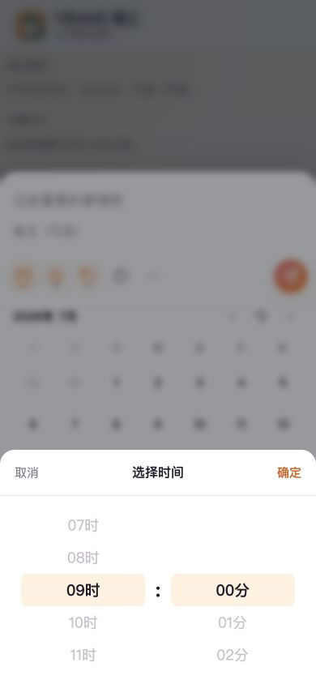

# 今日有序新增事项流程审查

日期：2026-07-22

## 审查范围

手机视口下从首页进入新增事项、打开日期面板、设置时间和进入详细编辑的流程。参考用户提供的 5 张「指尖时光」截图。本次检查基于本地页面和代码；浏览器自动化无法证明真实 iOS 系统键盘是否弹出，因此真机键盘行为仍需最终验证。

## 总体结论

现有视觉方向已经接近参考产品，尤其是底部输入区、内嵌日历和快捷工具栏。主要问题不是配色或圆角，而是弹层缺少统一导航模型：标题输入、快捷面板、旧选择器和详细页各自管理显示状态，导致滚动锁、父子返回和全屏层级不稳定。

## 流程证据

### 1. 首页入口 — 健康

- 新增按钮可发现，位于移动端常见的右下角位置。
- 页面背景内容较轻，入口视觉优先级足够。

### 2. 打开新增事项 — 部分健康

- 实测活动元素为 `quick-title`，自动聚焦已经生效。
- 底部编辑器层级清楚，标题、备注、快捷入口和保存操作都可见。
- `body` 未进入滚动锁定，全局任务滑动监听也未因编辑器打开而停止；有误操作背景内容的风险。
- 系统键盘是否真实出现仍需 iOS 真机验证。

### 3. 日期主面板 — 视觉健康、交互待统一

- 内嵌月历、快捷日期和底部设置项结构已经接近参考截图。
- 面板仅表达一个日期，没有开始/结束阶段。
- 当前面板通过动态 HTML 重建，选择与返回关系依赖点击处理器，缺少稳定的面板状态。
- 日期格和工具按钮的触控目标需要统一检查到至少 44px。

### 4. 时间选择 — 需要重构

- 时间轮盘本身可读，现有控件可以复用。
- 旧选择器以第二层 backdrop 覆盖在日期面板上，形成两个对话框同时存在的语义和视觉层级。
- 新版入口与旧选择器参数不匹配，只能保存开始时间点，未建立开始/结束流程。
- 确认后看似返回日期面板，实际是因为父面板一直留在遮罩后方，不是明确的父子导航。

### 5. 详细信息 — 不健康

- 字段结构完整，摘要清晰。
- 页面没有覆盖整个视口，只显示在底部区域。根因是全屏层位于带 transform 的底部面板内部，fixed 定位被限制。
- 返回后实测能重新聚焦标题，这是应保留的行为。
- 当前全屏页字段子入口会先退出详情，再延时打开底部快捷面板，容易产生闪动和焦点跳变。

## 最高优先级改进

1. 建立单一编辑会话状态机，统一键盘、快捷面板、二级面板和详情页。
2. 编辑期间锁定背景滚动并暂停全局滑动手势。
3. 日期面板增加开始/结束；时间、提醒、重复在同一区域替换，完成后返回日期主面板。
4. 将详细页移出底部面板的 transform 包含块，实现真正全屏。
5. 持久化未保存的新建草稿，蒙层或下滑关闭后可恢复。

## 可访问性风险与证据限制

- 截图和 DOM 能确认可读名称与焦点元素，但不能证明 VoiceOver/TalkBack 的朗读顺序和焦点圈定。
- 两个 dialog 同时暴露时，辅助技术可能无法判断当前活动层。
- 真实软键盘、浏览器返回手势、动态视口和安全区必须在 iOS/Android 真机验证。
- 颜色对比、44px 触控目标和减少动态效果需在实现后做测量和交互测试。
